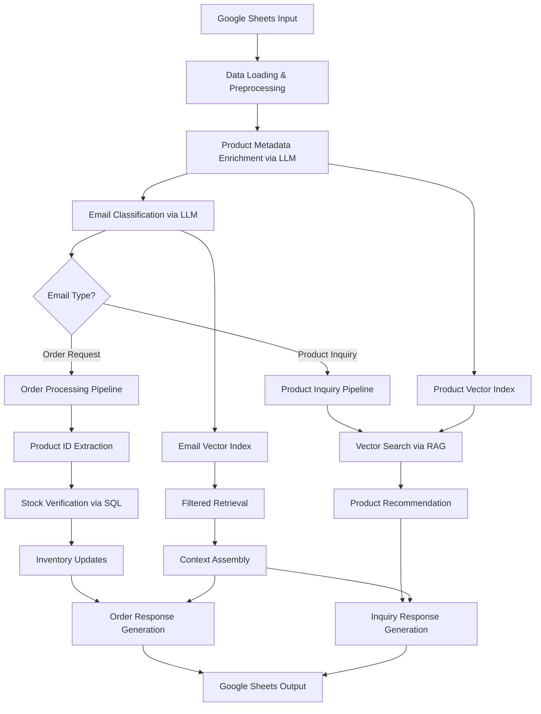

# AI-Powered Email Processing System using LLM + RAG

This project demonstrates a comprehensive **Retrieval-Augmented Generation (RAG)** pipeline that intelligently processes customer emails for a retail product catalog. The system combines Large Language Models with vector search to classify emails, process orders, manage inventory, and generate professional responses at scale.

## Problem Statement

### Inputs
**Google Spreadsheet Document** containing:
* **Products Sheet**: Product catalog with fields including product ID, name, category, stock amount, detailed description, and season
* **Emails Sheet**: Sequential customer emails with email ID, subject, and message body

### Challenge Requirements
1. **Email Classification**: Categorize emails as "product inquiry" or "order request"
2. **Order Processing**: Handle inventory management, stock verification, and order fulfillment
3. **Response Generation**: Create professional, context-aware email responses
4. **Scalability**: Handle 100,000+ products without token limit issues using RAG techniques

### Outputs
Four organized result sheets:
- `email-classification`: Email categorization results
- `order-status`: Order processing with inventory updates
- `order-response`: Generated responses for order requests
- `inquiry-response`: Generated responses for product inquiries

---

## Architecture Overview

The pipeline implements a sophisticated RAG system with multiple specialized components:



---

## Detailed Data Flow

### 1. Data Ingestion & Preprocessing
```python
# Load data from Google Sheets
document_id = "14fKHsblfqZfWj3iAaM2oA51TlYfQlFT4WKo52fVaQ9U"
products_df = read_data_frame(document_id, "products")
emails_df = read_data_frame(document_id, "emails")
```

**Key Variables Created:**
- `products_df`: Raw product catalog DataFrame
- `emails_df`: Customer email data DataFrame
- `test_emails_df`: Working copy for processing

### 2. Product Metadata Enrichment
```python
# LLM-powered attribute extraction
product_list = [{'id': product['product_id'], 'name': product['name']} 
                for _, product in products_df.iterrows()]

# Extract type and gender using structured prompts
response = client.chat.completions.create(
    model="gpt-4o",
    messages=[{"role": "user", "content": test_prompt}],
    temperature=0
)
```

**Output:** `merged_product_df` - Enhanced product data with extracted `type` and `gender` attributes

### 3. Email Classification System
```python
# Batch classification for efficiency
batch_size = 50
batches = [test_emails_df['message'][i:i + batch_size] 
           for i in range(0, len(test_emails_df), batch_size)]

for batch in batches:
    prompt = build_batch_prompt(batch.tolist())
    # Process and extract classifications
```

**Output:** `classification_list` - Email categories ("order request" or "product inquiry")

### 4. Multi-Index RAG Implementation

#### Vector Store Creation
```python
# Product documents for semantic search
product_docs = [
    Document(text=f"type: {typeof}\ngender: {gender}\ncategory: {category}...", 
             metadata=metadata, id=metadata["product_id"])
    for _, row in merged_product_df.iterrows()
]

# Email documents for filtered retrieval
email_docs = [
    Document(text=f"Email Id: {row['email_id']}\nSubject: {row['subject']}...", 
             metadata={"email_id": row["email_id"], "category": row["category"]})
    for _, row in test_emails_df.iterrows()
]
```

#### Specialized Index Creation
```python
# Create persistent vector indices
productIndex = VectorStoreIndex.from_documents(product_docs)
emailIndex = VectorStoreIndex.from_documents(email_docs)

# Filtered query engines for different email types
email_query_engine_order_request = emailIndex.as_query_engine(
    filters=MetadataFilters([MetadataFilter(key="category", value="order request")]),
    similarity_top_k=50
)

email_query_engine_product_inquiry = emailIndex.as_query_engine(
    filters=MetadataFilters([MetadataFilter(key="category", value="product inquiry")]),
    similarity_top_k=50
)
```

### 5. Hybrid SQL + Vector Search for Orders

#### Database Integration
```python
# SQLite database for structured queries
merged_product_df.to_sql('products', conn, if_exists='replace', index=False)

# Natural language SQL retrieval
nl_sql_retriever = NLSQLRetriever(sql_database, tables=["products"])

def get_product_by_id_with_stock_available(product_id, quantity):
    result = nl_sql_retriever.retrieve(
        f"Return product complete details with product_id = {product_id} if stock >= {quantity}"
    )
    return result[0].node.metadata if result else None
```

#### Order Processing Logic
```python
# Extract product IDs and quantities from order emails
extracted_products = email_query_engine_order_request.query(product_id_quantity_prompt)

# Pattern matching for validation
pattern = r"Email ID:\s*(?P<Email_ID>\w+)\s*\|\s*Product ID:\s*(?P<Product_ID>[A-Z]{3}[0-9]{4})\s*\|\s*Quantity:\s*(?P<Quantity>\d+)"

# Fuzzy matching for incorrect product references
def fuzzy_search_product(product_name):
    result = nl_sql_retriever.retrieve(
        f"Return product details of product whose name is most similar to : {product_name}"
    )
    return result[0].node.metadata if result else None
```

**Key Variables:**
- `final_order_df`: Successfully parsed and validated orders
- `confusing_order_df`: Orders requiring fuzzy matching
- `all_orders`: Complete order information with product details and status

### 6. Advanced Product Recommendation System
```python
def get_similar_products(target_product_id, target_product_name, target_product_cat, retriever):
    retrieved_nodes = retriever.retrieve(
        f"find product similar to :{target_product_name}, match the type and category: {target_product_cat}"
    )
    return [{'product': node.metadata, 'score': node.score} 
            for node in retrieved_nodes if node.metadata['product_id'] != target_product_id][:2]
```

### 7. Response Generation Pipeline

#### Order Response Generation
```python
# Assemble complete order context with alternatives for out-of-stock items
all_order_json_dump = []
for order in all_orders:
    shipped = [product for product in order['products'] if product["status"] == "created"]
    out_of_stock = [product for product in order['products'] if product["status"] == "out of stock"]
    
    # Add alternatives for out-of-stock items
    for product in out_of_stock:
        product['info']['alternative'] = get_alternatives(
            product['info']["product_id"], 
            product['info']["name"], 
            product['info']["category"],
            product['quantity'],
            product_ret
        )
```

#### Product Inquiry Processing
```python
# Multi-stage inquiry processing
product_inquiry_all_lines = email_query_engine_product_inquiry.query(product_inquiry_info_prompt)
product_inquiry_with_product_info = product_query_engine.query(
    f"Based on these inquiries: {product_inquiry_all_lines}, provide detailed product information"
)

# Categorize inquiry types
def process_other_inquiry_data(lines):
    # Classify as: 'query', 'product_id_not_found', 'search_similar_products'
    for line in lines:
        has_intent = 'Intent to buy: yes' in product_info
        has_product_id = re.search(r'Product ID:\s*[A-Z0-9]+', product_info)
        # Classification logic...
```

---

## Key Components & Variables

### Data Structures
| Variable | Description | Type |
|----------|-------------|------|
| `products_df` | Raw product catalog | DataFrame |
| `merged_product_df` | Enhanced products with LLM attributes | DataFrame |
| `test_emails_df` | Processed email data with classifications | DataFrame |
| `final_order_df` | Validated orders ready for processing | DataFrame |
| `all_orders` | Complete order context for response generation | List[Dict] |

### RAG Indices
| Index | Purpose | Content |
|-------|---------|---------|
| `productIndex` | Product semantic search | Product descriptions, metadata |
| `emailIndex` | Email filtering and retrieval | Email content with categories |
| `product_query_engine` | General product queries | Full product catalog search |
| `email_query_engine_order_request` | Order-specific retrieval | Filtered order emails only |
| `email_query_engine_product_inquiry` | Inquiry-specific retrieval | Filtered inquiry emails only |

### Database Integration
```python
# SQL + NL querying capability
sql_database = SQLDatabase(engine, include_tables=["products"])
nl_sql_retriever = NLSQLRetriever(sql_database, tables=["products"])
```

### Output Sheets
| Sheet Name | Columns | Purpose |
|------------|---------|---------|
| `email-classification` | email ID, category | Email categorization results |
| `order-status` | email ID, product ID, quantity, status | Order processing outcomes |
| `order-response` | email ID, response | Generated order confirmations |
| `inquiry-response` | email ID, response | Generated product inquiry responses |

---

## RAG Implementation Highlights

### 1. Scalable Vector Search
- **Embedding Model**: `text-embedding-3-small` for efficient similarity search
- **Index Persistence**: Stored indices avoid recomputation
- **Filtered Retrieval**: Category-specific search engines

### 2. Hybrid Retrieval Strategy
- **Exact Matching**: SQL queries for product IDs and stock levels
- **Semantic Matching**: Vector search for product recommendations
- **Fuzzy Matching**: Fallback for unclear product references

### 3. Context-Aware Response Generation
- **Structured Prompts**: JSON-based context assembly
- **Multi-document Processing**: Batch operations for efficiency
- **Professional Tone**: Production-ready email responses

### 4. Token Optimization
- **Batch Processing**: Reduces API calls
- **Filtered Retrieval**: Returns only relevant documents
- **Structured Outputs**: Consistent parsing and validation

---

## Running the Pipeline

### Environment Setup
```python
os.environ["OPENAI_BASE_URL"] = 'your-endpoint'
os.environ["OPENAI_API_KEY"] = 'your-key'

# LlamaIndex configuration
Settings.embed_model = OpenAIEmbedding(model="text-embedding-3-small")
Settings.llm = OpenAI(model="gpt-4o")
```

### Google Sheets Integration
```python
# Authentication and output sheet creation
auth.authenticate_user()
creds, _ = default()
gc = gspread.authorize(creds)
output_document = gc.create('AI Email Processing Results')
```

### Final Output
The system generates a comprehensive Google Sheets document with all results:
```
https://docs.google.com/spreadsheets/d/{output_document.id}
```

---

## Performance Features

- **Batch Processing**: 50-email batches for classification efficiency
- **Index Persistence**: Cached embeddings for repeated runs
- **Memory Management**: Streaming approach for large datasets
- **Error Handling**: Robust parsing with fallback mechanisms
- **Scalability**: Handles 100,000+ products via RAG techniques

This implementation demonstrates production-ready RAG architecture that efficiently combines multiple AI techniques to solve complex business problems while maintaining scalability and accuracy.